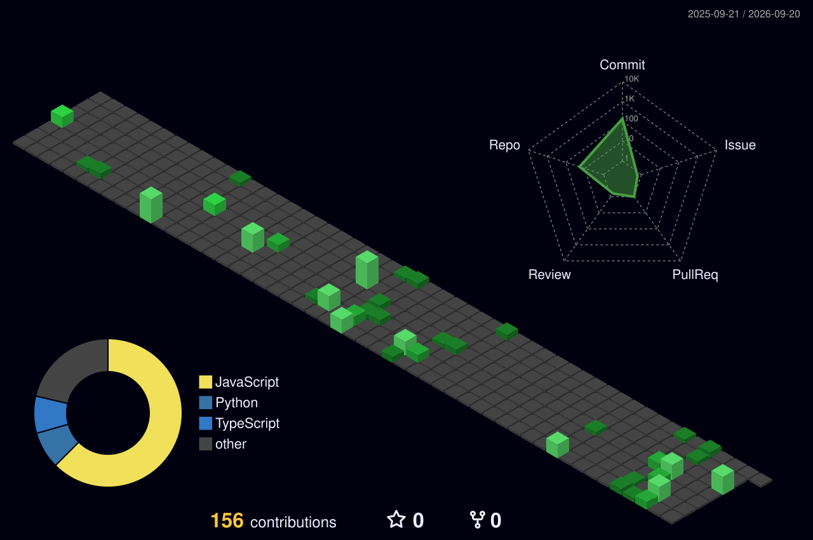

 

 

## About Me

I'm a student developer who builds across the stack — backend systems, mobile apps, and AI-integrated tools. I care more about whether something actually works end-to-end than whether it looks impressive on paper, and I default to automating a problem before I do it by hand twice.

**Currently focused on:** backend architecture & API design, AI agent workflows (n8n + LLM APIs), and full-stack product builds.

 

## Tech Stack

 

## Featured Projects

 

| Project | Problem it solves | Stack |
|---|---|---|
| **AI Resume Analyzer** | Scores resumes against job descriptions with ATS-style analysis, skill-gap detection, and improvement suggestions — plus a voice-driven mock interview flow | FastAPI, Groq/Ollama LLM, MongoDB, faster-whisper |
| **PDF & Image Translator** | Extracts and translates text out of PDFs and images through a Python backend, so users aren't stuck copy-pasting into translation tools by hand | FastAPI, React, Python |
| **ThinkBoard** | Full-stack board management app for organizing structured content through a responsive interface | React, Node.js |

**Also building:** an AI-powered job search platform (n8n-orchestrated pipeline that parses resumes, discovers matching jobs via API, and emails digests automatically) and an interactive React visualizer for Hadoop internals (HDFS/MapReduce/YARN). *(Repo links to add once public — replace the row below or drop it if you'd rather keep the table to shipped work only.)*

 

## Problem Solving

`C++` · `Data Structures & Algorithms` · `Object-Oriented Programming`

 

## GitHub Analytics

*Stats via a self-hosted [github-readme-stats](https://github.com/anuraghazra/github-readme-stats), streak via [github-readme-streak-stats](https://github.com/DenverCoder1/github-readme-streak-stats), 3D contribution graph via [github-profile-3d-contrib](https://github.com/yoshi389111/github-profile-3d-contrib).*

 

## Let's Connect

  

Open to opportunities where I can build real products, own backend/API design, and work across full-stack and AI systems.

